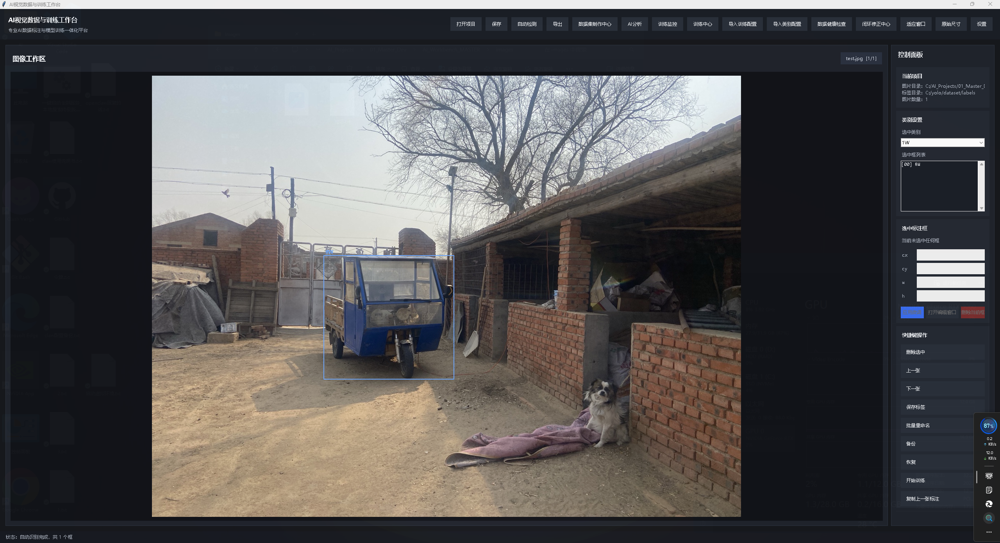
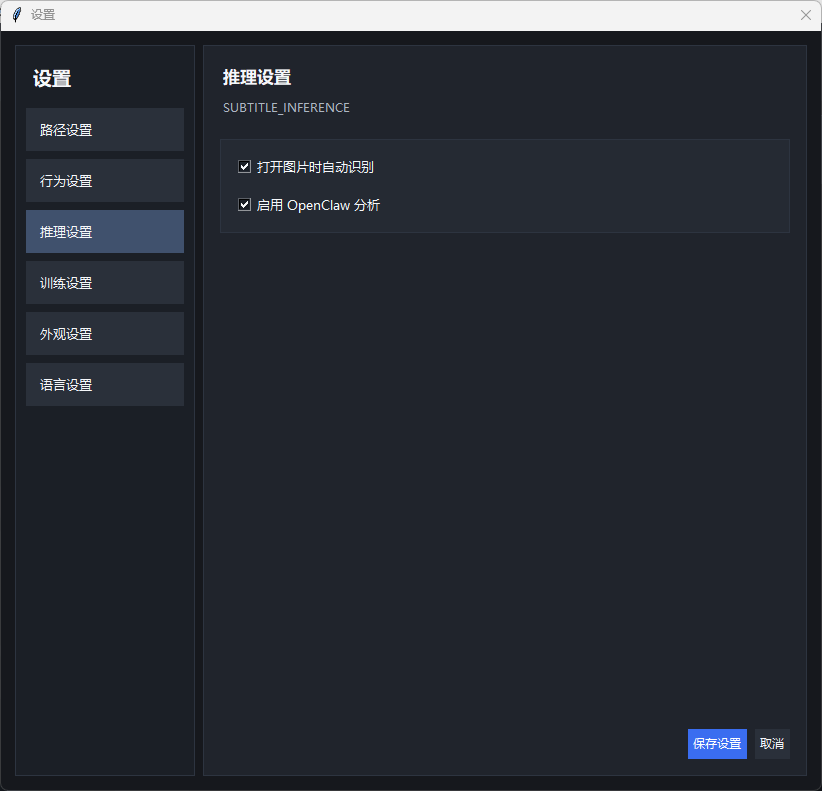
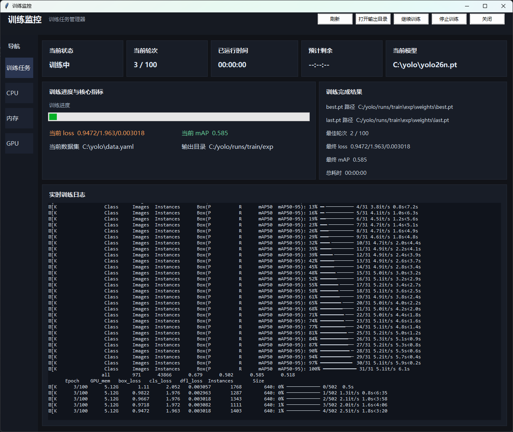
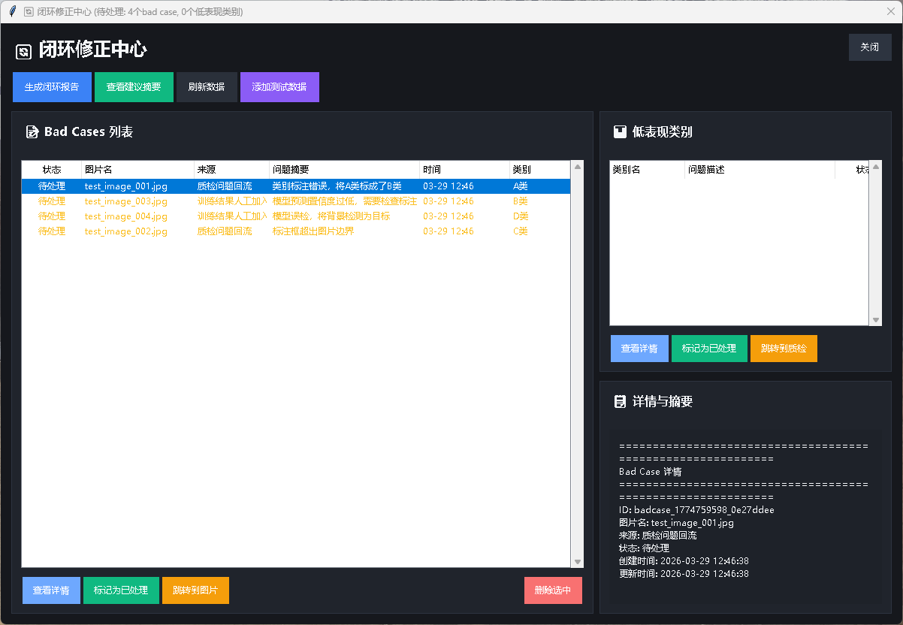

# AI Vision Data & Training Workbench

A comprehensive desktop application for AI vision data annotation, training, monitoring, and correction workflows.

## Features

- **Annotation Workspace**: Image viewing, bounding box editing, category management
- **Training Center**: Model training, experiment management, result analysis
- **Quality Inspection**: Data health checks, anomaly detection, auto-fix
- **Closed-Loop Correction**: Bad-case review, feedback loops, iterative improvement
- **OpenClaw Integration**: AI-assisted workflows, task automation, remote control

## Installation

```bash
# Clone the repository
git clone https://github.com/a740022938/AI-Vision-Data-Training-Workbench.git

# Install dependencies
pip install -r requirements.txt

# Run the application
python main.py
```

## Usage

1. **Start a new project**: File → New Project
2. **Import images**: Data → Import Images
3. **Annotate**: Use the annotation tools to label objects
4. **Train models**: Training Center → New Experiment
5. **Monitor progress**: View training metrics and logs
6. **Correct errors**: Closed-Loop Correction Center for bad-case review

## Screenshots

### Main Workbench / Annotation Workspace
The main annotation workspace, including image viewing, box editing, category selection, and project-side controls.



### Inference Settings
The settings interface for inference-related behavior, including automatic recognition and OpenClaw analysis options.



### Training Monitor
The training monitoring window for task status, metrics, logs, and output tracking.



### Closed-Loop Correction Center
The bad-case and correction workflow interface for reviewing low-performing samples and managing feedback loops.



## Architecture

The application follows a modular architecture with clear separation of concerns:

- **MainWindow**: Lightweight controller (zero business logic)
- **Core Modules**: Independent centers for annotation, training, quality, correction
- **OpenClaw Bridge**: AI collaboration interface with task orchestration
- **Context Management**: Centralized state management with backpack system

## Development

```bash
# Run tests
python auto_test.py

# Check code quality
python -m pylint core/ ui/

# Generate documentation
python generate_docs.py
```

## License

MIT License - see LICENSE file for details.

## Contributing

1. Fork the repository
2. Create a feature branch
3. Make your changes
4. Submit a pull request

## Support

For issues and feature requests, please use the GitHub Issues page.